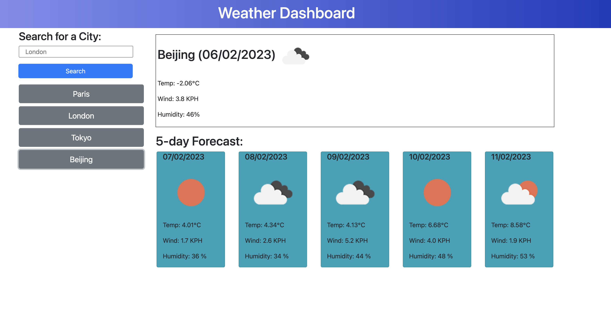

# Weather-Dashboard

This application is to make requests to the Weather API (https://openweathermap.org/api). The retrived data will be displayed on the webpage.

## Description
In this project, we will build a weather dashboard which will run in the browser and feature dynamically updated HTML, CSS and JavaScript. The API used include 'Current weather Data' and '5 Day / 3 Hour Forecast' API. The related documents can be found on the website of Weather API. The search history will be stored to local storage and displayed on the webpage.

## Main features
The Weather Dashboard can search the current and 5-day forecast weather information. The search hisotry will be stored for the quick search in the future.

* When the user can search a city, the current and future weather for that city will be dispalyed on the webpage. In addition, the city will be added to the search history if it is not searched before.

* The current weather information includes the city name, the date, an icon representation of weather conditions, the temperature, the humidity and the wind speed.

* The 5-day weather forecast information for that city is presented with the date, an icon representation of weather conditions, the temperature and the humidity.

* The user can click the history buttons for a quick search of the recorded city. The current and future weather conditions will be displayed.

* If the input city name is not found on the Weather API server, the webpage will alert the user.

## Deployment
Here is the screenshot of the application.

Click the link to test my webpage: https://xiaozhao1111.github.io/Weather-Dashboard/

## Contribution
Xiao Zhao, zhaoxiao20071106@gmail.com

## Community
It's open-source. Feel free to use it for learning purpose.